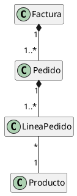
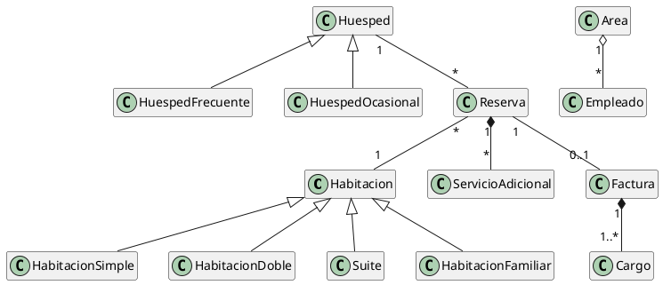

# 🎓 Presentación: Relaciones entre Clases en UML

> Presentación académica creada con **Reveal.js** para la materia Programación Orientada a Objetos del IES N° 6023 "Dr. Alfredo Loutaif".

---

## 📸 Preview

La presentación cubre dos ejercicios prácticos sobre relaciones UML (Composición, Agregación, Asociación y Herencia) aplicados a un Sistema de Ventas y un Sistema de Reservas de Hotel.

---

## 🛠️ Stack Tecnológico

| Herramienta | Versión | Rol |
|---|---|---|
| **[Reveal.js](https://revealjs.com/)** | 5.1.0 | Framework de presentaciones HTML |
| **HTML5 / CSS3 / JS** | — | Estructura, estilos y lógica |
| **[Inter](https://fonts.google.com/specimen/Inter)** | Google Fonts | Tipografía principal (headings + body) |
| **[JetBrains Mono](https://fonts.google.com/specimen/JetBrains+Mono)** | Google Fonts | Tipografía monoespaciada (código) |

### ¿Por qué Reveal.js?

Se eligió Reveal.js sobre PowerPoint/Google Slides por estas razones:

1. **Velocidad de desarrollo**: Al tener el contenido listo en texto plano, volcarlo a HTML semántico es muy rápido con asistencia de IA.
2. **Control total del diseño**: CSS puro permite un nivel de personalización que ninguna herramienta de slides ofrece (gradientes, glassmorphism, micro-animaciones, variables CSS).
3. **Portabilidad**: Es un único archivo HTML que funciona en cualquier navegador sin instalar nada. Se puede compartir por mail, subirlo a GitHub Pages, o abrir desde un pendrive.
4. **Versionable**: Al ser código, se puede versionar con Git y hacer cambios incrementales sin romper nada.

---

## 🏗️ Arquitectura del Proyecto

```
presentacion/
├── index.html          # Archivo único de la presentación (todo incluido)
├── diagramas/          # Carpeta para imágenes de diagramas UML
│   ├── ventas.png      # Diagrama PlantUML del Sistema de Ventas
│   └── hotel.png       # Diagrama PlantUML del Sistema de Hotel
└── README.md           # Este archivo
```

### Decisión: Todo en un solo archivo

Se optó por mantener **todo en `index.html`** (HTML + CSS + configuración JS) en lugar de separar en múltiples archivos. Razones:

- Facilita compartir (un solo archivo)
- No requiere servidor local (se abre con doble click)
- Para una presentación de este tamaño (~25 slides) no hay impacto en performance
- Las dependencias (Reveal.js, fuentes) se cargan desde CDN

---

## 🎨 Sistema de Diseño

### Paleta de Colores

El tema es **dark mode** con acentos vibrantes. Se definieron variables CSS para mantener consistencia:

```css
--accent-primary: #7c6aef;     /* Púrpura — color principal */
--accent-secondary: #06d6a0;   /* Verde menta — herencia, éxito */
--accent-warning: #ffd166;     /* Amarillo — agregación, atención */
--accent-danger: #ef476f;      /* Rosa/Rojo — composición, crítico */
--accent-info: #118ab2;        /* Azul — asociación, información */

--surface-1: #12121a;          /* Fondo de contenedores */
--surface-2: #1a1a28;          /* Cards y elementos elevados */
--surface-3: #22223a;          /* Elementos interactivos */
--border-subtle: rgba(124, 106, 239, 0.2);  /* Bordes sutiles */
```

### Código de colores por relación UML

Cada tipo de relación tiene un color asignado que se usa consistentemente en toda la presentación:

| Relación | Color | Variable CSS |
|---|---|---|
| **Composición** | Rosa/Rojo `#ef476f` | `--accent-danger` |
| **Asociación** | Azul `#118ab2` | `--accent-info` |
| **Agregación** | Amarillo `#ffd166` | `--accent-warning` |
| **Herencia** | Verde `#06d6a0` | `--accent-secondary` |

### Componentes Reutilizables

Se crearon clases CSS reutilizables para mantener consistencia visual:

- **`.relation-card`** — Tarjetas con borde lateral de color según tipo de relación
- **`.relation-badge`** — Badges/etiquetas pequeñas (ej: `COMPOSICIÓN`)
- **`.tag`** — Tags inline para marcar tipos de relación
- **`.highlight-box`** — Cajas de cita/destaque con borde izquierdo
- **`.diagram-container`** — Contenedor de diagramas con borde gradiente superior
- **`.problem-box`** — Caja para enunciados de problemas
- **`.section-title`** — Slides de título de sección con número grande
- **`.guide-card`** — Tarjetas de la guía rápida final
- **`.title-meta`** — Grid de metadatos de la portada

---

## 📐 Estructura de Slides (25 en total)

```
01. Portada (datos institucionales)
02. Agenda (4 secciones)

── SECCIÓN 01: Guía Rápida ──
03. Título de sección
04. Tabla resumen de relaciones
05. Detalle: Asociación + Agregación
06. Detalle: Composición + Herencia

── SECCIÓN 02: Sistema de Ventas ──
07. Título de sección
08. Enunciado del problema
09. Clases identificadas
10. Diagrama UML + leyenda
11. Relación: Factura → Pedido (Composición)
12. Relación: Pedido → LineaPedido (Composición)
13. Relación: LineaPedido → Producto (Asociación)

── SECCIÓN 03: Sistema de Hotel ──
14. Título de sección
15. Enunciado del problema
16. Clases identificadas
17. Diagrama UML + leyenda
18. Herencia (Habitaciones + Huéspedes)
19. Reserva → ServicioAdicional (Composición)
20. Área → Empleado (Agregación)
21. Factura → Cargo (Composición)
22. Asociaciones simples

── SECCIÓN 04: Conclusión ──
23. Título de sección
24. Resumen: ¿Cómo distinguir cada relación?
25. Slide final (¡Gracias!)
```

---

## ⌨️ Controles de la Presentación

| Tecla | Acción |
|---|---|
| `→` / `Espacio` | Slide siguiente |
| `←` | Slide anterior |
| `F` | Pantalla completa |
| `Esc` | Vista general (overview) |
| `S` | Speaker notes (notas del presentador) |
| `?` | Ayuda de atajos |

---

## 🖼️ Diagramas UML

Los diagramas fueron generados con **PlantUML** y exportados como PNG. Para regenerarlos:

### Diagrama de Ventas (`diagramas/ventas.png`)



### Diagrama de Hotel (`diagramas/hotel.png`)



### Opciones para renderizar PlantUML

1. **Online**: [plantuml.com/plantuml](https://www.plantuml.com/plantuml/) — Pegar código y descargar PNG
2. **VS Code**: Extensión "PlantUML" de jebbs
3. **CLI**: `java -jar plantuml.jar diagrama.puml`

---

## 🔧 Técnicas CSS Destacadas

### 1. Gradientes en texto (Título principal)
```css
h1 {
  background: linear-gradient(135deg, #e8e8f0, #7c6aef);
  -webkit-background-clip: text;
  -webkit-text-fill-color: transparent;
}
```

### 2. Borde gradiente superior en contenedores
```css
.diagram-container::before {
  content: '';
  position: absolute;
  top: 0; left: 0; right: 0;
  height: 3px;
  background: linear-gradient(90deg, #7c6aef, #06d6a0);
}
```

### 3. Cards con borde lateral por tipo de relación
```css
.relation-card.composicion { border-left: 4px solid #ef476f; }
.relation-card.asociacion  { border-left: 4px solid #118ab2; }
.relation-card.agregacion  { border-left: 4px solid #ffd166; }
.relation-card.herencia    { border-left: 4px solid #06d6a0; }
```

### 4. Badges con fondo semitransparente
```css
.relation-badge.comp {
  background: rgba(239,71,111,0.15);
  color: #ef476f;
}
```

### 5. Números de sección con gradiente fade
```css
.section-number {
  font-size: 5em;
  font-weight: 900;
  background: linear-gradient(180deg, rgba(124,106,239,0.3), transparent);
  -webkit-background-clip: text;
  -webkit-text-fill-color: transparent;
}
```

---

## 📝 Lecciones Aprendidas / Tips para Futuras Presentaciones

### Lo que funcionó bien

1. **Reveal.js desde CDN** — Cero setup, cero dependencias locales. Solo un HTML.
2. **Variables CSS** — Cambiar toda la paleta de colores es editar 5 líneas.
3. **Un color por concepto** — Composición = rojo, Asociación = azul, etc. Crea una guía visual instantánea.
4. **Componentes reutilizables** — Las clases `.relation-card`, `.tag`, `.highlight-box` se usan en todas las slides sin repetir estilos inline.
5. **`data-auto-animate`** — Transiciones suaves automáticas entre slides que comparten elementos.
6. **Fallback para imágenes** — `onerror` en los `` muestra un placeholder amigable si la imagen no existe.

### Lo que hay que tener en cuenta

1. **Tamaño de viewport** — Reveal.js tiene un viewport fijo (`width: 1200, height: 700`). Todo el contenido debe caber ahí. Si se corta, hay que reducir padding/margins/font-sizes.
2. **No sobrecargar slides** — Menos texto = mejor presentación. Usar viñetas cortas y dejar que el presentador explique.
3. **Code blocks como "ruido"** — El código técnico (como PlantUML syntax) no aporta valor al público. Mejor usar leyendas visuales con badges de color.
4. **Emojis como icons** — Funcionan perfecto como iconos rápidos sin necesitar SVGs ni icon fonts.

---

## 🔄 Cómo Reutilizar para Otro Trabajo

1. Copiar `index.html`
2. Editar las variables CSS (`:root`) si querés cambiar colores
3. Reemplazar el contenido de las `<section>` con tus nuevas slides
4. Actualizar los datos de portada (`.title-meta`)
5. Cambiar las imágenes en `diagramas/`
6. ¡Listo!

---

## 📄 Licencia

Uso académico — IES N° 6023 "Dr. Alfredo Loutaif", 2026.
