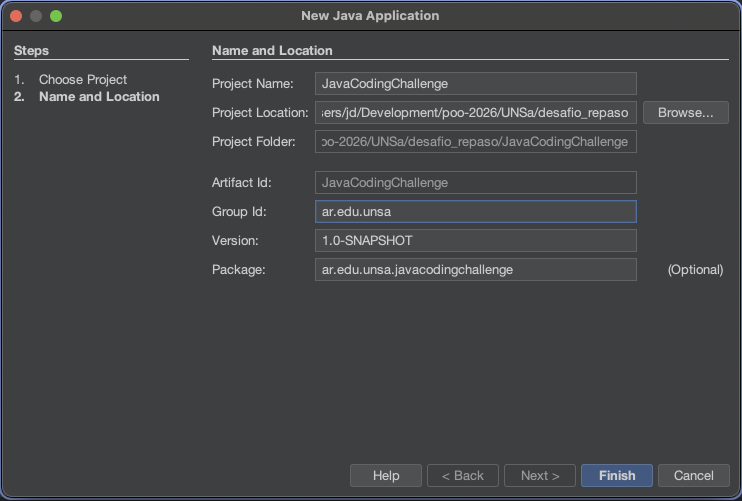
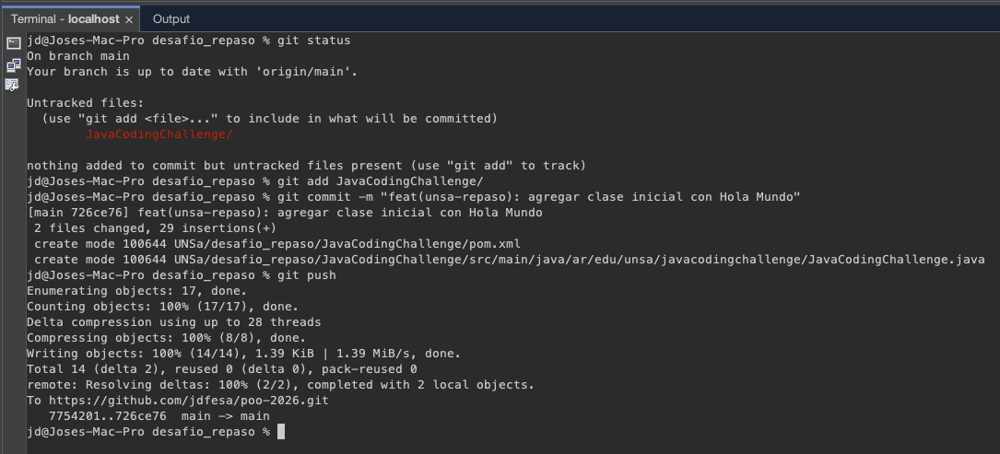

# Desafíos y Repaso (UNSa)

Esta carpeta contiene ejercicios de práctica, repasos de programación estructurada y desafíos extra en Java propuestos por la cátedra de la UNSa.

A diferencia de los Trabajos Prácticos (TPs), estos ejercicios **no se entregan obligatoriamente** en repositorios individuales del profesor, pero se documentan aquí para mantener el historial de estudio y el *Single Source of Truth* del monorepo.

## Contenido

- *(Aquí podrás listar los distintos ejercicios o archivos a medida que los vayas creando)*

## JavaCodingChallenge (OneCompiler a NetBeans)

Para familiarizarnos con las herramientas de la cursada, como el IDE NetBeans, los ejercicios originales de OneCompiler se están desarrollando y ejecutando localmente siguiendo buenas prácticas.

La configuración del proyecto en NetBeans para estos ejercicios es la siguiente:
- **Project Name**: JavaCodingChallenge
- **Group Id**: `ar.edu.unsa`
- **Artifact Id**: JavaCodingChallenge
- **Version**: `1.0-SNAPSHOT`
- **Package**: `ar.edu.unsa.javacodingchallenge`



## Arquitectura y Flujo de Trabajo: JavaCodingChallenge

Para la resolución de los 15 ejercicios propuestos originalmente en OneCompiler, hemos establecido un flujo de trabajo estructurado dentro del IDE NetBeans utilizando un proyecto basado en Maven.

### Enfoque de Organización: Múltiples Clases con Métodos Main Independientes (Enfoque 1)

**Decisión:** En lugar de crear un proyecto de NetBeans separado para cada ejercicio (lo cual generaría mucho "ruido" de archivos de configuración `pom.xml`, carpetas `target/`, etc.) o de sobrescribir constantemente un único archivo, hemos optado por crear **una clase Java por cada ejercicio** (`Ejercicio01.java`, `Ejercicio02.java`, ..., `Ejercicio15.java`) dentro del mismo paquete base `ar.edu.unsa.javacodingchallenge`. 

**Justificación de buenas prácticas:**
1. **Simplicidad y Agrupación:** Todos los ejercicios de una misma temática ("desafío repaso") se mantienen cohesionados bajo un único proyecto Maven y un solo repositorio.
2. **Historial Completo:** Al no borrar código, mantenemos el historial completo de nuestro progreso y aprendizaje, permitiéndonos consultar cómo resolvimos un problema anterior.
3. **Ejecución Aislada:** En Java, podemos tener múltiples clases con su propio método `public static void main(String[] args)`. NetBeans permite ejecutar de forma independiente cada archivo haciendo clic derecho > **Run File** (o `Shift + F6`), aislando la ejecución sin conflictos.
4. **Fácil Navegación:** El árbol del proyecto en el IDE permanece limpio y es fácil saltar de un ejercicio a otro.

### Flujo de Trabajo Diario en NetBeans

1. **Creación del Archivo:** En el panel "Projects" de NetBeans, navega a `Source Packages > ar.edu.unsa.javacodingchallenge`. Clic derecho > `New > Java Class` y nómbrala siguiendo el formato `EjercicioXX` (ej. `Ejercicio01`).
2. **Desarrollo:** Implementa la lógica del ejercicio correspondiente de OneCompiler, asegurándote de incluir el método `main`.
3. **Ejecución Local:** Usa `Shift + F6` (o clic derecho sobre el archivo > `Run File`) para probar tu código en la consola integrada de NetBeans.
4. **Control de Versiones (Git):** Utilizaremos la terminal integrada de NetBeans. Desde la raíz del monorepo (o desde la carpeta del proyecto si el contexto de Git está bien configurado en el monorepo), ejecutaremos los comandos para versionar nuestro progreso:
   ```bash
   git add .
   git commit -m "feat(desafio): implementar EjercicioXX - [Nombre corto del ejercicio]"
   git push
   ```
   *Ejemplo del flujo de trabajo de Git funcionando desde la terminal integrada del IDE:*
   

### Progreso de Ejercicios (OneCompiler)

- [x] Ejercicio 01: Sort names in an alphabetical Order
- [x] Ejercicio 02: Print the sum of the digits of a given number
- [x] Ejercicio 03: Increment the digits of a number by 1
- [ ] Ejercicio 04: Print the sum of odd and even numbers present in an array
- [ ] Ejercicio 05: Calculate perimeter of a Rectangle
- [ ] Ejercicio 06: Convert age into number of days
- [ ] Ejercicio 07: Check if sum of two numbers is less than 100?
- [ ] Ejercicio 08: Print Hi UserName, Welcome to companyName from email-id
- [ ] Ejercicio 09: Print fibonacci series
- [ ] Ejercicio 10: Factorial of a given number
- [ ] Ejercicio 11: Remove first and last character from a string
- [ ] Ejercicio 12: Count the repetitive characters present in a string
- [ ] Ejercicio 13: Convert Minutes into Seconds
- [ ] Ejercicio 14: Calculate area of a triangle
- [ ] Ejercicio 15: Check if a given number is palindrome or not

---

### ❓ Dudas sobre Git (Archivos Untracked, git init)
Si al crear este proyecto de NetBeans has notado que toda la carpeta aparece como **`Untracked files`** (en rojo) al hacer `git status`, y no estás seguro de si debes hacer `git init` o cómo hacer el primer commit, **por favor, revisa la sección de Troubleshooting en nuestro [WORKFLOW.md](../../docs/WORKFLOW.md#1-archivos-untracked-al-crear-un-nuevo-proyecto-en-subcarpetas)** donde documentamos paso a paso el flujo correcto para monorepos.


